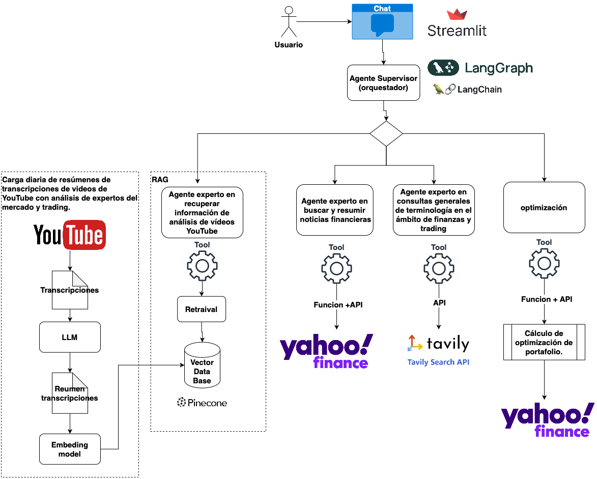
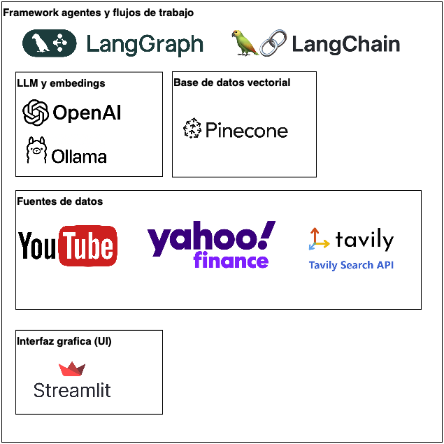
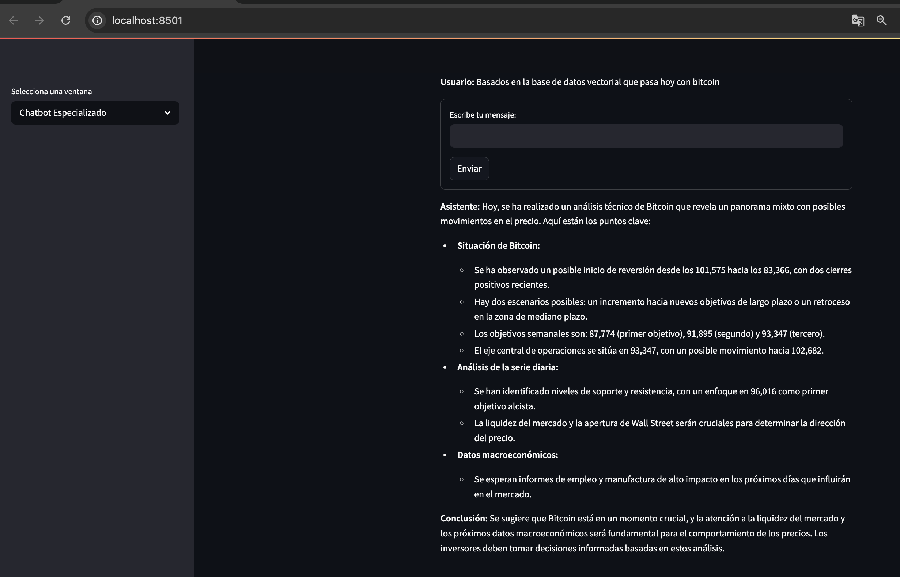
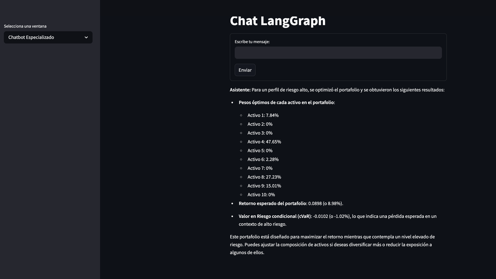

# Agente de Recomendación de Inversión

## Descripción del Proyecto

El **Agente de Recomendación de Inversión** es un sistema diseñado para ayudar a inversores independientes, especialmente aquellos sin experiencia o tiempo, a tomar decisiones informadas sobre sus inversiones. Este agente utiliza inteligencia artificial para analizar datos financieros y generar recomendaciones personalizadas basadas en el perfil de riesgo del usuario.

## Público Objetivo

El sistema está dirigido a:
- Inversores independientes sin experiencia previa.
- Personas con poco tiempo para investigar y analizar opciones de inversión.

## Funcionalidades

1. **Identificación del Perfil de Riesgo**:
   - Clasifica a los usuarios en perfiles de riesgo: bajo, medio o alto.
   - Genera un portafolio de inversión adecuado según el perfil identificado.

2. **Resúmenes de Noticias Financieras**:
   - Proporciona resúmenes de las noticias más relevantes del ámbito financiero.

3. **Consejos de Inversión**:
   - Analiza contenido publicado por expertos en YouTube para ofrecer consejos prácticos.

4. **Sistema de Respuesta a Preguntas (RAG)**:
   - Utiliza un sistema (RAG) para responder preguntas de los usuarios basandose en analsis de expertos traidas desde sus canales de youtube.
   - Almacena y procesa información relevante para ofrecer respuestas precisas y útiles.

## Fuentes de Datos

El sistema utiliza las siguientes fuentes de datos para:

- **Transcripciones de videos de YouTube**:
  - Contenido de expertos en trading e inversión (cada dia se cargan resumenes de videos con analisis de expertos en VDB). [Resumen de noticias financieras](src/app/extract_load_data/youtube_ingest.py)
- **Noticias Financieras**:
  - Información obtenida de plataformas como Yahoo Finance.
- **Datos Históricos de Precios**:
  - Precios históricos de activos financieros para análisis y proyecciones.

## Arquitectura





## Agente BASADO EN llM

El agente utiliza modelos de lenguaje (LLM) y una arquitectura supervisor-workers usando langraph y langchain para dar respuestas personalizadas:

- **llm**:
[tools tahoo finance](src/tools/custom_yahoo_finance_tools.py)
[other tools](src/tools/tools.py)
  - **ollama** y **openai**: Proveedores de modelos de lenguaje para análisis y generación de texto.
- **Tools**:
  - Resumen de noticias financieras. Api yahoo finance
  - Clasificación de perfil de riesgo y Generación de portafolios sugeridos. Api uahoo finance y funcion de optimizacion portafolios
  - Búsqueda y recuperación de información relevante (RAG) expertos.
  - Informacion de terminologia. Tavily
- **Almacenamiento**:
  - **Pinecone**: Vector database para almacenamiento y recuperación eficiente de embeddings y documentos relevantes.
- **Planificación**:
  - **Supervisor-trabajadores**: Arquitectura donde un supervisor coordina tareas y varios trabajadores ejecutan funciones especializadas (extracción, resumen, análisis, etc.).
  - [Grafo del asistente chatbot especializado](src/app/graphs/supervisor_graph.py)


## Cómo Empezar

1. Clona este repositorio:
   ```bash
   git clone https://github.com/tu_usuario/investing_chat_agent.git

2. Instala librerias en requirements.txt
   ```bash
   pip install -r requirements.txt

4. configurar variables de ambiente

    ```bash
    LANGCHAIN_TRACING_V2=true
    LANGCHAIN_ENDPOINT="https://api.smith.langchain.com"
    LANGCHAIN_API_KEY="......"
    LANGCHAIN_PROJECT="......"
    API_KEY_YOUTUBE= "....."
    BASE_URL_YOUTUBE='https://www.googleapis.com/youtube/v3/'
    TAVILY_API_KEY = '......'
    OPENAI_API_KEY = '......'
    PINECONE_API_KEY = '........'
    ```
   **Nota**: Para ejecucion de la interface grafica son obligatorias -> TAVILY_API_KEY,OPENAI_API_KEY,PINECONE_API_KEY.
   Para la ingesta y actualizacion de datos en base de datos vectorial son obligatorias->PINECONE_API_KEY,API_KEY_YOUTUBE.
   
### Ejecución de la Aplicación con Streamlit

Para lanzar la interfaz de usuario, puedes ejecutar cualquiera de las siguientes aplicaciones:

- Para la versión completa:
  ```bash
  streamlit run src/app/chat/chat_app.py
  ```




- Para la versión simple:
  ```bash
  streamlit run src/app/chat/chat_app_simple.py
  ```

- Para ejecutar el monitoreo de la evaluación:
  ```bash
  streamlit run src/app/chat/dashboard.py
  ```

Asegúrate de tener instaladas las dependencias necesarias antes de ejecutar los comandos.


## Notebooks de Ejemplo

En la carpeta [`notebooks/`](notebooks/) encontrarás ejemplos prácticos para explorar y probar las funcionalidades del agente:

## Notebooks de Ejemplo

En la carpeta [`notebooks/`](notebooks/) encontrarás ejemplos prácticos para explorar y probar las funcionalidades del agente:

- [`notebooks/load_youtube_Video_Transcript_to_vdb.ipynb`](src/notebooks/load_youtube_Video_Transcript_to_vdb.ipynb):
  Explica cómo cargar transcripciones de videos de YouTube de expertos en inversión y almacenarlas en la base de datos vectorial (Pinecone) para su posterior análisis y recuperación. Incluye ejemplos de extracción y procesamiento de texto.

- [`notebooks/Tool Calling News.ipynb`](src/notebooks/Tool%20Calling%20News.ipynb):
  Demuestra cómo obtener noticias financieras desde fuentes externas y generar resúmenes automáticos utilizando modelos de lenguaje. Permite comparar el texto original con el resumen generado.

- [`notebooks/test_supervisor_graph.ipynb`](src/notebooks/test_supervisor_graph.ipynb):
  Presenta un flujo de conversación usando LangGraph y LangChain, mostrando cómo el agente responde preguntas del usuario, integra herramientas y recupera información relevante de la base de datos.

- [`notebooks/optimizacion_portafolio.ipynb`](src/notebooks/optimizacion_portafolio.ipynb):
  Ejemplo de cómo generar y optimizar portafolios de inversión personalizados según el perfil de riesgo del usuario, utilizando técnicas de optimización y datos financieros reales.

- [`notebooks/test_chat_langgraph.ipynb`](src/notebooks/test_chat_langgraph.ipynb):
  Muestra cómo interactuar con el agente conversacional usando LangGraph, integrando diferentes herramientas y fuentes de información para responder preguntas complejas.

Cada notebook incluye celdas ejecutables y explicaciones paso a paso para facilitar la comprensión y experimentación.
